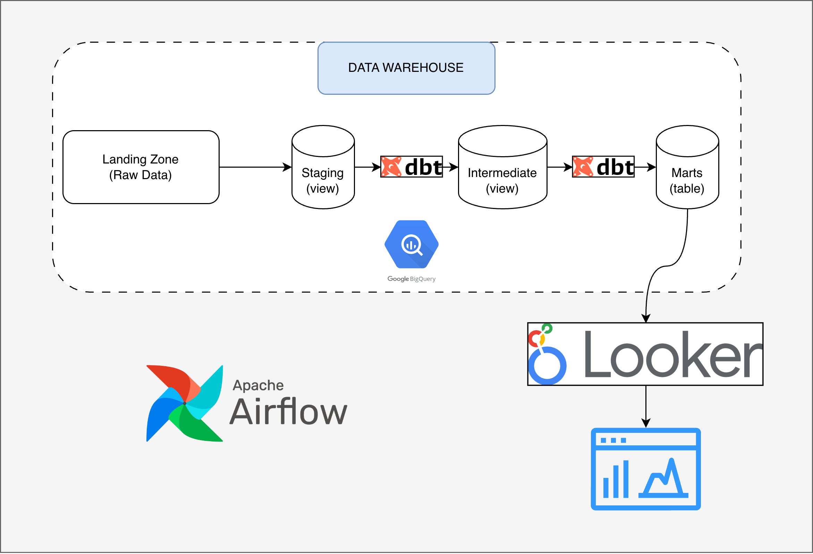

# dbt_fraud_analytics
## Introduction 
### About Data
The project used this dataset [Olist](https://www.kaggle.com/datasets/olistbr/brazilian-ecommerce).
Schema likes below:

### About this project
In this project, I aim to build a E-commerce system to clarify 3 Big Questions:
+ Sale & Revenue: How much is the revenue? Average of orders? which is the most populative payment method? ...

+ Logistics & Operations: Did the deliveried on time? how long it take to delivery? which zone take longest time? ...

+ Customer Satifaction: calculate the Average start of reviews. Which products or items are most underated/overated? ...

There for, I had design a pipeline for Business to figure out all business insights which the architecture be like:

---

## Architecture 
This project using architecture:
landing zone (raw) -> staging (view) -> intermediate (ephemeral) -> marts (table)